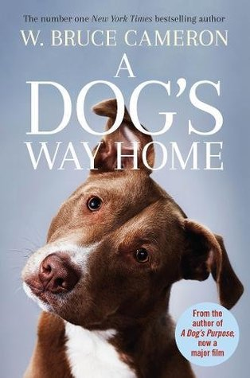
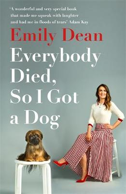
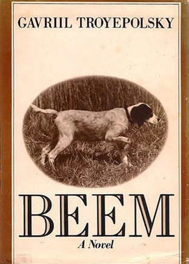

# HUMAN BEST FRIEND: 5 EXCITING BOOKS ABOUT DOGS

- Bruce Cameron. "The Way Home"

One day Lucas finds a puppy, takes him to his place and calls him Bella. The breed of dog resembles a pit bull, but according to state law they are prohibited. Someone reports the illegal pet to the police, and Lucas has to give his pet to friends from another city, otherwise he will be put to sleep. But Bella does not want to part with the owner and goes on a dangerous journey to return home. In two years she will travel 400 miles, will have amazing adventures, will meet new friends and finally will return to Lucas. Prepare paper handkerchiefs: without tears this touching story can not be read! In 2019, based on the novel was made a film of the same name, which is also worth seeing, but, of course, after reading the book.

- Emily Dean. "Everyone died, and I got a dog."

Most of all, Emily wanted to have a puppy as a child. But in the chaos in which her family lived, it was impossible. The childhood was over, the dream of a pet never came true, and then came perhaps the most difficult period in the life of the heroine: first her sister died, and then her parents. The girl was under a lot of stress. And it was then she remembered her long desire. Emily got a puppy shih tzu nicknamed Raymond, and a new friendship helped the heroine to return to life and believe that the world is beautiful again. This funny and touching story will make you smile more than once and lift your spirits even on the most cloudy day.

- Gavriil Troepolsky. "White Bim Black Ear.

The Scottish setter Beam from birth differed by a non-standard color, for which he got his nickname. Its owner, Ivan Ivanovich - a lonely pensioner, former front-line soldier - did not dote in his pet and regularly took it on hunting. Once Ivan Ivanovich went to hospital because of heart problems, and the dog went in search of his master and met different people on his way. Bim almost waited for his master to return, but because of human cruelty his friends were not destined to meet him. Incredibly sad and piercing book about loyalty. By the way, the Soviet film of the same name was nominated for an Oscar in the category "Best Foreign Language Film.

- Susan Petik. "A Dog as a Present"

Kiran is only nine years old, but he can't be called a happy child. Recently, he and his family moved to a small town of Bolingbrok and can not get settled in a new place: classmates bully him, and friends are far away. The only thing the young hero likes is a walk with his grandfather. Once in the forest, they find a funny puppy, to whom Kiran instantly gets attached and decides to take the baby home. Finally he will have a real friend! That's only how the mother will react to the puppy, and does he have no owners?

- John Grogan. "Marley and me: life with the most horrible dog in the world.

Newlyweds John and Jenny adore each other and dream of having a child. But first they decide to have a labrador named Marley. An active and tireless dog destroys the house, constantly testing the owner's patience for strength. But despite all the difficulties and embarrassing situations arising from the dog, John and Jenny love Marley. And soon they have children for whom the dog is the best friend. The book is based on the real story of John Grogan's family and was filmed. In the film, the main characters played the famous Hollywood actors Owen Wilson and Jennifer Aniston.

